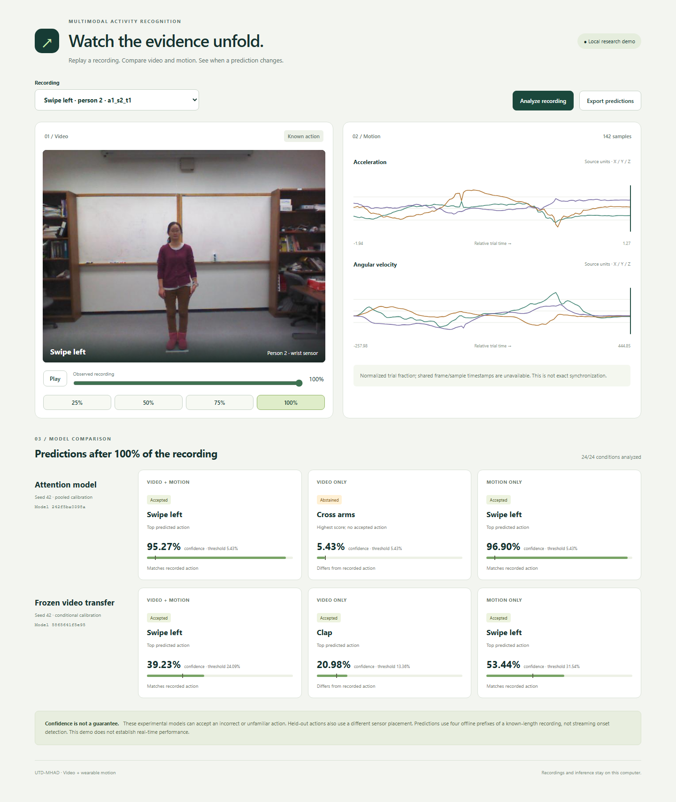

# Video + IMU Activity Recognition

Compare activity models on paired video and wearable motion recordings.
The application includes learned sensor/video encoders, late fusion,
cross-modal attention, contrastive pretraining, early predictions,
missing-sensor tests, calibrated uncertainty, and a frozen video backbone.
A local React replay shows predictions, confidence, accepted errors, and
abstentions across observation fractions and sensor combinations.

## Demo

[Setup and screenshot gallery](docs/DEMO.md) ·
[Open locally after setup](http://127.0.0.1:8000)

The interactive demo runs on your computer with a Python service, recordings,
and trained model packages. There is no publicly hosted instance.



Actual demo: `a1_s2_t1` (swipe left), full recording, seed 42. Paired and
motion-only predictions match the action; video-only predictions do not.
The frame is from [UTD-MHAD](docs/DATA.md); dataset terms are separate from the
code license. The gallery also shows an unfamiliar-action failure.

## Repository layout

- `src/`: Python training, evaluation, and service code.
- `web/` and `native/`: React replay and C++ inference.
- `docs/`: setup, methodology, and limitations.
- `results/`: published measurements.
- `requirements/` and `tests/`: pinned dependencies and checks.

Run the documented commands from the repository root.

## Try it

Start with [the replay setup](docs/DEMO.md) for Python 3.11 and Node 24. It explains
data access, model reproduction, export, and the local browser application.
Recordings and trained models are not redistributed. Downloads use official
sources and pinned checksums; training creates the model packages locally.

For a smaller CPU baseline, create and activate a virtual environment:

```sh
python -m venv .venv
# Activate .venv using your shell.
python -m pip install -r requirements/requirements.txt
python src/fetch_data.py --video
python src/activity.py baseline --inertial data/Inertial.zip --rgb data/RGB.zip
```

Open `runs/baseline/report.html`. The sensor baseline also works without
`--video` and `--rgb`. See [data terms and trial splits](docs/DATA.md).

## Measured results

The 27-action studies test 430 recordings from people excluded from training.
Neural comparisons report three-seed means where indicated; these are separate
architectures, not an isolated estimate of video's contribution.

| Model | Accuracy | Macro-F1 |
| --- | ---: | ---: |
| Sensor SVM | 78.14% | 0.775 |
| Neural concatenation, three seeds | 81.16% | 0.801 |
| Cross-modal attention, three seeds | 79.30% | 0.789 |
| Contrastive attention, three seeds | 76.82% | 0.764 |

Attention and contrastive pretraining did not improve mean performance.
See [all seed results](results/attention/summary.json) and
[learning curves](results/attention/report.html).

A separate protocol trains on 21 actions and holds six actions out of fitting.
It uses 336 known and 94 held-out test recordings. These scores are not directly
comparable with the 27-action results.

| Known-action accuracy, three-seed mean | Augmented attention | Frozen video transfer |
| --- | ---: | ---: |
| Full paired recording | 70.44% | 52.78% |
| Quarter paired recording | 46.33% | 35.81% |
| Full video only | 4.76% | 30.46% |
| Full IMU only | 67.36% | 63.19% |

Transfer improved video-only recognition but reduced paired accuracy.
**Unknown-action rejection remains unreliable:** attention accepted every
unfamiliar full-paired trial; transfer rejected only 0.71% on average.
Sensor placement also changes between known and held-out action groups.
See [failure analysis and evaluation limits](docs/MODEL_CARD.md).

## Reproduce and inspect

| Topic | Instructions | Published measurements |
| --- | --- | --- |
| Sensor baseline and dataset | [DATA.md](docs/DATA.md) | [Baseline](results/metrics.json) |
| Independent encoders and late fusion | [MODELING.md](docs/MODELING.md) | [Neural baseline](results/multimodal/metrics.json) |
| Attention and contrastive learning | [ATTENTION.md](docs/ATTENTION.md) | [Nine runs](results/attention/summary.json) |
| Partial observations, sensor noise and calibration | [ROBUSTNESS.md](docs/ROBUSTNESS.md) | [Six runs](results/robustness/summary.json) |
| Frozen video transfer | [TRANSFER.md](docs/TRANSFER.md) | [Three runs](results/transfer/summary.json) |
| FastAPI, ONNX and C++ inference | [SERVING.md](docs/SERVING.md) | [Parity and latency](results/serving) |
| React replay and local MLflow | [DEMO.md](docs/DEMO.md) | [Release checks](results/release) |

ONNX preserved all 25,800 tested calibrated decisions. Representative native
C++ outputs matched Python ONNX exactly. Latency measurements include the
expensive video backbone separately; no real-time guarantee is made.

The replay aligns paired recordings by relative trial fraction. Released IMU
arrays have no shared frame/sample timestamps, so this is offline inspection
of segmented trials, not exact timestamp synchronization or online detection.
The dataset contains eight people; results do not establish generalization to
arbitrary videos, populations, sensor placements, or unfamiliar activities.

Code is MIT licensed. Dataset and pretrained weights have separate terms in
[DATA.md](docs/DATA.md) and [TRANSFER.md](docs/TRANSFER.md). Load only trusted model files.
